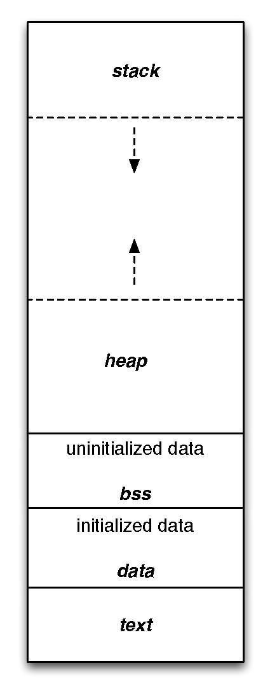

template: titleslide

# Managing resources
## James Richings, EPCC
## j.richings@epcc.ed.ac.uk

---
# Resources

In a program you often need to manage things like:

- memory

- open files

- GPUs

- network sockets

???

Let's talk a bit about memory first

---
# Memory: overview

.columns[
.col[
Modern OSes given each process a flat address space

Each byte can be accessed by its address, which is just a number.

For most purposes this can be considered in two parts:
- stack
- heap
]
.col[
.center[

]
]
]

---
# Memory: stack

In C++ (and C and many other compiled languages) local variables are
stored in the **stack**.

As your program runs, the local variables that are defined, get space
allocated by the compiler relative to the current stack frame.

Each time you call a function, you start a new stack frame by
incrementing the stack pointer.

Variables are implemented as offsets from this, so allocating a local
variable has no run-time cost.

When you return from a function, the stack pointer is updated and
deallocation also has no cost

These allocations are called *static* because they have to be prepared
at compile time

---
# Memory: heap
 
The language and OS also make available some memory for dynamic
allocation: the *heap*

You need to request some memory to store an object and then give it
back when you are finished.

```C++
int main()
{
   // This memory for 3 integers
   // is allocated on heap.
   int *ptr  = new int[3]{1,2,3};

   // To keep things tidy we need to manually call delete
   delete[] ptr;
}
```


???

Fortran has allocatable arrays and somewhat restricted pointers

C programmers will be familiar with malloc and free, which is also
present in C++, but should never be used (I can't recall ever having
done so)

---
template: titleslide
# Reminder Classes and Constructors

---
# Classes

- User defined types.

- can be defined with either the `class` or `struct` keyword.
  
```C++
struct Complex {
  double re;
  double im;
};
```

- Creating trivial types - give the class name then list the values to be assigned to the
members, _in order_, inside braces:

```C++
Complex mk_imaginary_unit() {
  return Complex{0, 1};
}
```
This is called aggregate initialisation.

---
# Constructors

Often you want to control the creation of instances of your classes.

You do this with _constructors_ - these are special member "functions"
with the same name as the type.

```C++
struct Complex {
  Complex() = default;
  Complex(double re);
  Complex(double re, double im);
  double re = 0.0;
  double im = 0.0;
};
```

Note we declare three:
- one that initialises with a purely real value
- one that initialises with a real and imaginary value
- a *default constructor* which needs no arguments (that we tell the
  compiler to generate for us as before with `= default` )

???

Control in more detail than just starting from a default value or
having to provide *all* the of member values.

Constructors are not strictly functions in C++ but very nearly (next slide)

Why do you have to "explictly default the default constructor"?

Because the language rules say if the user provides any constructors,
the compiler must not create one unless asked to...

---
# Constructors

- Constructors are not directy callable
- Constructors do not return a value
- Constructors can do initialisation of member variables before the body begins execution


Let's define the ones we declared just now:

```C++
Complex::Complex(double real) : re{real} {
}

Complex::Complex(double real, double imag) : re{real}, im{imag} {
}
```

---
# Destructors

You can also control what happens when your objects reach the end of
their lifetime.

When this happens is deterministic:
- when a local variable goes out of scope
- when an object that contains them is destroyed
- when the programmer `delete`s them

For a class `Name` they are declared like:

```C++
struct Name {
  ~Name();
};
```

It's important to note that you should **never call this directly** -
the compiler will call it for you when your objects are deallocated.

???

Note the tilde syntax is the logical negation of the class. Cf
annihilation operators for any physicists.


---
# Resource allocation is instantiation

A very important pattern in C++ is **RAII**: resource allocation is
instantiation.

Also known as constructor acquires, destructor releases (CADRe).

This odd name is trying to communicate that any resource you have
should be tied to the lifetime of an object.

So the when the compiler destroys your object it will release the
resource (e.g. memory).

???

Saying that in some philosophical sense allocating a resource is the
creation of something, which implies its destruction later.

---
# RAII example

A very simple copy of `std::vector<double>`:

```C++
class my_array {
  unsigned size = 0;
  double* data = nullptr;
public:
  my_array() = default;
  explicit my_array(unsigned n) : size(n), data(new double[size]) {}
  ~my_array() {
    delete[] data;
  }
  double& operator[](unsigned i) {
    return data[i];
  }
};
```

???

This class allocates some memory to store `n` doubles when constructed

When it reaches the end of its life the destructor returns the memory
to the OS

It allows users to access elements (with no bounds checking)

---
# What happens when we compile and run?

Add a few annotations to print in the contructor/destructor

???

Open sample/arr1.cpp
Compile and run

What happens if we copy x?

Add `auto x_cp = x;` (same as `auto x_cp = my_array{x};`)

---
# Copying

When you value assign an object in C++ this will only be valid if
there is a *copy constructor* or *copy assignment operator*

--

Copy constructor - when you create a new object as the destination:

```C++
my_array x{10}; // Direct initialisation
my_array y{x}; // Direct initialisation
my_array z = x; // Copy initialization
```

--
Copy assignment - when you assign a new value to an existing object

```C++
my_array x{10};
x = my_array{2000};
```

???

What's the diff?

In the last case, you have to deal with releasing any resources held
by the target object

---
# Implicit copy

The compiler will automatically generate these operations for us if
all the data members of you class are copyable.

So what went wrong with the example shown?

--
A pointer is just a number and so it can be copied implicitly - hence the double delete

If we want to copy our array then we need to either:
- copy the data (aka deep copy)
- share the data and somehow keep track of when the last reference to it is destroyed (aka shallow copy)

???

Deep copies are more expensive at run time but somewhat safer

Shallow copies can be faster but harder to implement correctly and can have thread safety issues

Do we want to copy?

---
# User-defined copy

Of course, you can control how your objects are copied


```C++
class my_array {
  unsigned size = 0;
  double* data = nullptr;
public:
  my_array() = default;
  explicit my_array(unsigned n) : size(n) data(new double[size]) {}
  my_array(my_array const& other) : size(other.size), data(new double[size]) {
    // Copy data
  }
  my_array& operator=(my_array const& other) {
    delete[] data;
    size = other.size;
    data = new double[size];
	// Copy data
	return *this;
  }
  ~my_array() {
    delete[] data;
  }
};
```
???

Open arr2.cpp

Note the signature

---
# Returning a value looks a lot like copying

When a function returns a value, you might think that will copy it to the target:

```C++
std::vector<int> ReadData() {
  std::vector<int> answer;
  // Read it from somewhere
  return answer;
}

int main() {
  auto data = ReadData();
}
```

???

Thinking about std::vector examples we've seen and that you might have implemented

Have previously said that you should use bare auto when you want a
copy - by that what we really mean is you want to *own* the object and
control its lifetime.

Copying a vector of billions of elements is going to get expensive and
would be counter to C++'s zero overhead abstractions principle

---
# Move instead

Since C++11, the language has supported the concept of *moving* from
objects which the compiler knows (or the programmer asserts) will not
be used any more.

Examples are:
- temporaries (i.e. the result of a function call/constructor expression)
- automatic variables that are going out of scope
- the result of calling `std::move` on an object

The destination object "steals" the contained resources from the
source object and sets the source to a valid but undefined state -
typically the only operations you can perform on a moved-from object
are destruction and assignment.

---
# Move implementation

Going back to our simple array:
```C++
class my_array {
  unsigned size = 0;
  double* data = nullptr;
public:
  // c'tors, copy assignment, d'tor
  my_array(my_array&& other) noexcept : size(other.size), data(other.data) {
    other.size = 0;
    other.data = nullptr;
  }
  my_array& operator=(my_array&& other) noexcept {
    std::swap(size, other.size);
    std::swap(data, other.data);
  }
};
```

???

Comment on `noexcept` - this is for STL compatibility. The containers
will copy if your move operations are not noexcept. These ones cannot
throw exceptions so this is safe.


Look at arr3.cpp

---
# The Rule of Five

This says that if you define or delete one of the following:
- copy constructor
- copy assignment operator
- move constructor
- move assignment operator
- destructor

then you should probably do so for all five.

???
This can be quite a lot of work!

---
# The Rule of Zero

This says that unless your class is solely deals with ownership, then
it should define none of the five special functions.

This is really a corollary of the general software engineering 
"principle of single responsibility".

You should split your code into a resource manager with all five
functions and a user class that has none, but uses the resource
manager as one or more data members.

???

If it does deal with ownership then rule of 5 applies :(

---

# my_array Exercise

Time to try this out for yourself your own class.

**Part 1**

- Implement the constructor
- Implement the destructor

**Part 2**

- Implement the copy constructor
- Implement the copy assignment operator

**Part 3**

- Implement the move constructor
- Implement the movement move assignment operator


N.B. Add print statements to each function call in my_vector so you can see when each of the class members are called.

