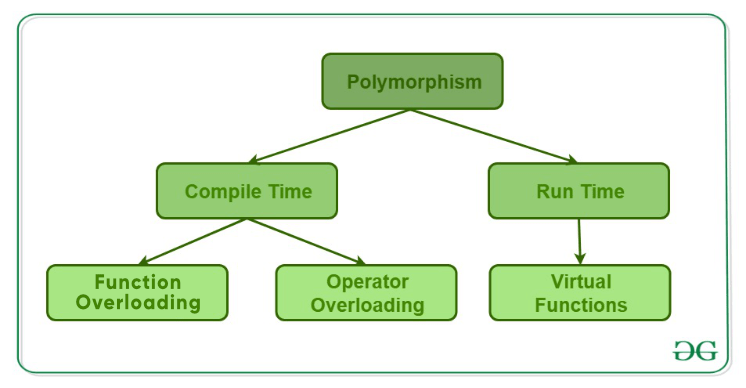

template: titleslide
# Combining classes
## James Richings
## j.richings@epcc.ed.ac.uk

---
# Class manipulation so far

We have discussed:

- How to create new object types with classes.
- How to edit the properties of classes around:
  - creation
  - destruction
  - copying
  - movement
- How to build containers with classes with a specific purpose.
- How to use templates so that classes can be used in a generic way.

---
# Whats left?

**Can we combine classes to make new classes?**

- Inheritance
- Multi-level Inheritance
- Multiple Inheritance
- More Access specifiers
- Polymorphism
- ... also lots more but we will stop here.

---
# Inheritance

In C++ it is possible to inherit methods and attributes from another class.

There are two types of classes when we talk about inheritance.

- Derived or child classes: class that inherits from another.
- Base or parent classes: class that is inherited from.

```C++
class Parent
{
	public:
	    Parent() = default;
	    int a;
};

class Child : Parent
{
	public:
        Child() = default;
        int b;
};
```
Class `Child` has data members `a` and `b`.

---
# Access specifiers: members

The previous example everything is public but what is we want to control access 

```C++
class Parent
{
public:
        Parent() = default;
protected:
        int a = 1;
};

class Child : Parent
{
public:
        Child() = default;

        void Print() 
		{
           std::cout << "a: " << a << std::endl;
           std::cout << "b: " << b << std::endl;
        }
private:
        int b = 2;
};
```

---
# Access specifiers: members


 - **`public`**:
   - members are accessible from outside the class.
  
 - **`private`**: 
   - members cannot be accessed (or viewed) from outside the class.

 - **`protected`**:
   - members cannot be accessed from outside the class, however, they can be accessed in inherited classes.

```C++
int main()
{
 Child x;
 x.Print();
}
```
```C++
./access
a: 1
b: 2
```

---
# Access specifiers: Inheritance

We can also specify the level of access we want when we inherit the parent class in the child class.

```C++
class Parent
{
	Parent() = default;
	
	public:
	    int a1;
	protected:
		int a2;
	private:
	    int a3;
};

class Child : public Parent
{
        Child() = default;
	private:
        int b;
};
```
- **`public inheritance`**:
  - makes public members of the base class public in the derived class, and the protected members of the base class remain protected in the derived class.

---
# Access specifiers: Inheritance

We can also specify the level of access we want when we inherit the parent class in the child class. 

```C++
class Parent
{
	Parent() = default;
	
	public:
	    int a1;
	protected:
		int a2;
	private:
	    int a3;
};

class Child : protected Parent
{
        Child() = default;
	private:
        int b;
};
```
- **`protected inheritance`**:
  -  makes the public and protected members of the base class protected in the derived class.

---
# Access specifiers: Inheritance

 We can also specify the level of access we want when we inherit the parent class in the child class.

```C++
class Parent
{
	Parent() = default;
	
	public:
	    int a1;
	protected:
		int a2;
	private:
	    int a3;
};

class Child : private Parent
{
        Child() = default;
	private:
        int b;
};
```
- **`private inheritance`**:
  -  makes the public and protected members of the base class private in the derived class.

---
# Multi-level inheritance
```C++
class Grandparent
{
public:
        Grandparent() = default;
protected:
        int a = 1;
};
class Parent : public Grandparent
{
public:
        Parent() = default;
protected:
        int b = 1;
};
class Child : public Parent
{
public:
        Child() = default;
        void Print() 
		{
           std::cout << "a: " << a << std::endl;
           std::cout << "b: " << b << std::endl;
		   std::cout << "c: " << c << std::endl;
        }
private:
        int c = 3;
};
```

???
The "Its turtles all the way down" of classes
We can have classes that inherit from classes that are have already inherited from a base class.
---
# Multi-level inheritance

Multi-level inheritance allows us to inherit in chain.

**The "Its turtles all the way down" of classes**

Simple test:
```C++
int main()
{
 Child x;
 x.Print();
}
```

Result:
```C++
./multilevel
a: 1
b: 2
c: 3
```

---
# Multiple inheritance

```C++
class ParentA
{
public:
        ParentA() = default;
protected:
        int a = 4;
};
class ParentB
{
public:
        ParentB() = default;
protected:
        int b = 5;
};
class Child : public ParentA, public ParentB
{
public:
        Child() = default;
        void Print() {

         std::cout << "a: " << a << std::endl;
         std::cout << "b: " << b << std::endl;
         std::cout << "c: " << c << std::endl;
        }
private:
        int c = 6;
};

```

???
Classes can also be derived from more than one base class.
Why limit yourself to one class when you can really confuse yourself...

---
# Multiple inheritance

Why limit yourself to one class when you can really confuse yourself...

Simple test:
```C++
int main()
{
 Child x;
 x.Print();
}
```
Result:
```C++
./multiclass
a: 4
b: 5
c: 6
```

---
# The diamond problem

.center[]

https://www.geeksforgeeks.org/diamond-problem-in-cpp/

???
Two classes inherit the same base class inherited by a third class

---
# The diamond problem

```C++
class Base {
public:
    void fun() { std::cout << "Base" << std::endl; }
};

class ParentA : public Base {
public:
};

class ParentB : public Base {
public:
};

class Child : public ParentA, public ParentB {
};

int main()
{
    Child* obj = new Child();
    obj->fun();

    return 0;
}
```

---
# The diamond problem  

Error:

```C++
g++ diamond.cpp -o diamond
diamond.cpp: In function ‘int main()’:
diamond.cpp:26:10: error: request for member ‘fun’ is ambiguous
   26 |     obj->fun(); // Abiguity arises, as Child now has two copies of fun()
      |          ^~~
diamond.cpp:6:10: note: candidates are: ‘void Base::fun()’
    6 |     void fun() { std::cout << "Base" << std::endl; }
      |          ^~~
diamond.cpp:6:10: note:                 ‘void Base::fun()’
```

Issue:

```C++
int main()
{
    Child* obj = new Child();
    obj->fun(); // Abiguity arises, as Child now has two copies of fun()
    return 0;
}
```

---
# The diamond problem: virtual

```C++
// Base class
class Base {
public:
    void fun() { std::cout << "Base" << std::endl; }
};

class ParentA : virtual public Base {
public:
};

class ParentB : virtual public Base {
public:
};

class Child : public ParentA, public ParentB {
};

int main()
{
    Child* obj = new Child();
    obj->fun(); // No ambiguity due to virtual inheritance
    return 0;
}
```

---
# Inheritance and constructors

```C++
class ParentA
{
  public:
  ParentA()
  {
          std::cout << "Constructor of the base class ParentA" << std::endl;
  }
};

class ParentB
{
  public:
  ParentB()
  {
          std::cout << "Constructor of the base class ParentB" << std::endl;
  }
};

class Child: public ParentA, public ParentB
{
  public:
  Child(): ParentA(), ParentB()
  {
          std::cout << "Constructor of the derived class Child" << std::endl;
  }
};
```

---
# Inheritance and constructors
Simple test:

```C++
int main()
{
  Child obj;
  return 0;
}
```
Result:

```C++
./multiConst
Constructor of the base class ParentA
Constructor of the base class ParentB
Constructor of the derived class Child
```

N.B. Order of of construction matches order of inheritance

---
# Inheritance and destructors

```C++
class ParentA
{
  public:
  ParentA() = default;
  ~ParentA()
  {
          std::cout << "Destructor of the base class ParentA" << std::endl;
  }
};
class ParentB
{
  public:
  ParentB() = default;
  ~ParentB()
  {
          std::cout << "Destructor of the base class ParentB" << std::endl;
  }
};
class Child: public ParentA, public ParentB
{
  public:
  Child() = default;
  ~Child()
  {
          std::cout << "Destructor of the derived class Child" << std::endl;
  }
};
```

---
# Inheritance and destructors

Simple test:

```C++
int main()
{
  Child obj;
  return 0;
}
```
Result:

```C++
./multiDestruct
Destructor of the derived class Child
Destructor of the base class ParentB
Destructor of the base class ParentA
```

N.B. Order of of destruction reverse order of inheritance

---
# Polymorphism

```C++
class Parent
{
public:
        Parent() = default;
        void Print()
        {
            std::cout << "print from parent" << std::endl;
            std::cout << "a: " << a << std::endl;
        }

protected:
        int a = 1;
};

class Child : Parent
{
public:
        Child() = default;
        void Print()
                {
           std::cout << "print from child" << std::endl;
           std::cout << "a: " << a << std::endl;
           std::cout << "b: " << b << std::endl;
        }
private:
        int b = 2;
};
```

???
Allows us to use inheritance to do different things in the derived class than specified in the base class with the same methods.

---
# Polymorphism

Simple test:

```C++
int main() {

Child x;

x.Print();

Parent y;

y.Print();

}
```
Result:

```C++
print from child
a: 1
b: 2
print from parent
a: 1
```
---
# Virtual functions

```C++
class base {
public:
    virtual void print() { std::cout << "print base class" << std::end; }

    void show() { std::cout << "show base class" << std:endl; }
};

class derived : public base {
public:
    void print() { std::cout << "print derived class" << std::endl; }

    void show() { std::cout << "show derived class" << std::endl; }
};

int main()
{
    base* bptr;
    derived d;
    bptr = &d;

    // Virtual function, binded at runtime
    bptr->print();
    // Non-virtual function, binded at compile time
    bptr->show();

    return 0;
}
```

---
# Virtual functions

Test:
```C++
int main()
{
    base* bptr;
    derived d;
    bptr = &d;

    // Virtual function, binded at runtime
    bptr->print();
    // Non-virtual function, binded at compile time
    bptr->show();

    return 0;
}
```
Result:
```C++
./virtual
print derived class
show base class
```

---
# Override

```C++
class Base
{
  public:
    // user wants to override this in the derived class
    virtual void func()
    {
        std::cout << "I am in base" << std::endl;
    }
};

class derived : public Base
{
  public:
    // did a silly mistake by putting an argument "int a"
    void func(int a) override
    {
        std::cout << "I am in derived class" << std::endl;
    }
};

int main()
{
    Base b;
    derived d;
    std::cout << "Compiled successfully" << std::endl;
    return 0;
}
```

---
# Types of polymorphism

.center[]

https://www.geeksforgeeks.org/cpp-polymorphism/
---
template:titleslide
# Exercise

---
# Exercise

Take the example complex class we wrote a couple of days ago and ...


- **`Try inheritance`**: 
  - Split complex up so that the contructors and data members live in the base class and a magnitude squared function is in a derived class
- **` Try multi-level inheritance`**:
  - Now in a third class write a absolute magnitude function and have this class inherit from the previous 
- **`Try multiple inheritance`**: 
  - Take new copy of your complex class with only data members
  - Write an real and imaginary getter class
  - Write a magnitude class that inherits the other two classes to make a complete complex class.
- **`Polymorphism`**
  - Compile part 4 with `g++ main.cpp -o main`
  - Run `main`
  - Look at the code and can you explain how the inheritance works?
  - Can you correct the forcast?


---
template: titleslide
# Great we can combine classes... ...now what?
---
template: titleslide
# Design patterns

---
# Design pattern

- **`Creational`**:
  - "These patterns provide various object creation mechanisms, which increase flexibility and reuse of existing code."
- **`Structural`**:
  - "These patterns explain how to assemble objects and classes into larger structures while keeping these structures flexible and efficient."
- **`Behavoural`**:
  - "These patterns are concerned with algorithms and the assignment of responsibilities between objects."

Nice resource for this: https://refactoring.guru/design-patterns/catalog

Books:

- [Gang of 4 design patterns](https://www.google.co.uk/books/edition/Design_Patterns/6oHuKQe3TjQC?hl=en&gbpv=0)

- [Patterns for Parallel Programming](https://www.google.co.uk/books/edition/Patterns_for_Parallel_Programming/LNcFvN5Z4RMC?hl=en&gbpv=0)

- Slightly dusty [ARCHER course material](http://www.archer.ac.uk/training/course-material/2018/11/parallel-patterns-oxford/slides/L01-Introduction.pdf)
---
# Creational Patterns


- Factory
- Abstract factory
- Builder
- Singleton
- Prototype

---
# Structural

- Adapter
- Bridge
- Composite
- Decorator
- Facade
- Flyweight
- Proxy

---
# Behavourial

- Chain of Responsibility
- Command
- Iterator
- Mediator
- Memento
- Observer
- State
- Strategy
- Template Method
- Visitor

